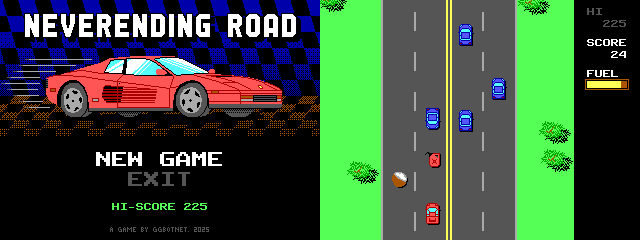
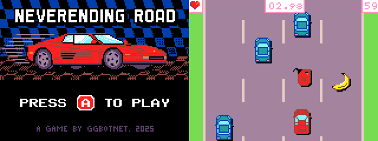

# NeverEnding Road
Welcome to **NeverEnding Road**, an open-source game project featuring a top-down 2D endless driving game. Players will navigate a sports car across an infinite landscape, skillfully avoiding other vehicles and collecting fruits along the way.

## Gameplay
In this game, players will:
- Drive a sports car through an endless landscape.
- Avoid collisions with other vehicles.
- Collect fuel to keep the car running.
- Gather fruits to increase your score.

## Game Engines

### Godot Engine

- **Supported Versions:**
  - Godot 2.1.6
  - Godot 3.6
  - Godot 4.4

### MakeCode Arcade

- **Play in Browser:** [Play Now](https://arcade.makecode.com/90641-66423-08097-80341)
- **Importing the Source:** To load the game into MakeCode Arcade, simply drag and drop the `.png` file into [arcade.makecode.com](https://arcade.makecode.com) to get started.
